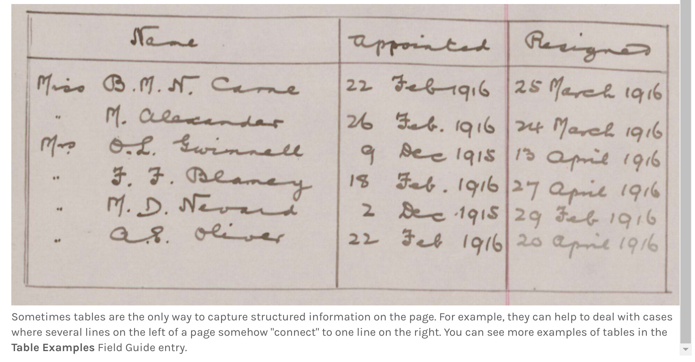
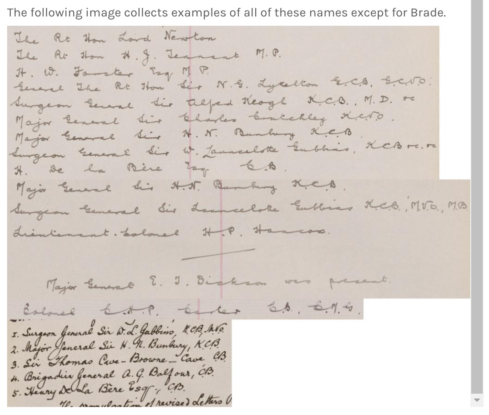
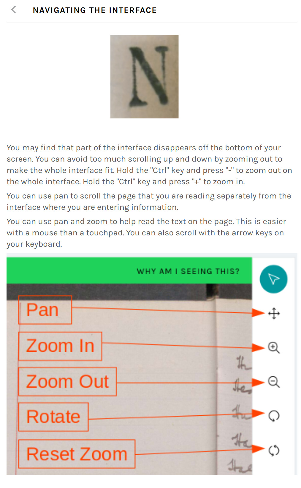

---
#diff -s <(find */ -type f | sort) <(grep jpeg sb_guidance.md | grep -v '^#' | sed 's/^\!\[\](//' | sed 's/.$//' | sort)
#T-numbers in filenames for Help text are arbitrary, nothing to do with underlying workflow task numbers
title: Scarlets and Blues User Guidance
toc: true
toc-depth: 2
numbersections: yes
hyperrefoptions:
  linktoc=all
colorlinks: yes
linkcolor: blue
tocolor: purple
pagenumbering:
  location: footer
header-includes:
  \usepackage[default,scale=0.6]{opensans}
  \exhyphenpenalty=10000
  \hyphenpenalty=10000
...

<!-- Footnote text -->
[^untitle]: This task does not have an explicit title in the user interface

<!-- Main doc -->
# Note

The following screenshots record the instructions and advice given to volunteers on Scarlets and
Blues. The screenshots are fairly heavily compressed.

These screenshots were taken in December 2022, well after the project's completion. Some instructions
may have been added or altered over the lifetime of the project.

Images embedded in instructions can sometimes be clipped or missed entirely, depending on the sizing of the
browser window. Where an image has been clipped in a screenshot, this is noted below the image. Of course,
images may have been clipped for volunteers, too.

Where pages had to be scrolled, there will be a series of overlapping images showing the whole content of
the page.

Some of the pages contain links. Of course, images of links do not work, so any links are given beneath
each image.

# Field Guide

## Landing Page

## Meetings Workflow

### Links

* "video examples"
  * Links to the *Scarlets and Blues Walkthough* in the *Towards a National Collection* YouTube channel
  * [https://youtube.com/playlist?list=PLRIxrpy54RHa27xcP31kiD05m0o-WCPPV](https://youtube.com/playlist?list=PLRIxrpy54RHa27xcP31kiD05m0o-WCPPV)

## Meetings: Attendance Pages

### Links

* "video example"
  * Links to the *Scarlets and Blues Transcription: The Meetings workflow (Part 1)* video in the *Towards a National Collection* YouTube channel
  * [https://youtu.be/fSqzKCzKhgo](https://youtu.be/fSqzKCzKhgo)

### Notes

The bottom of the final example image has not rendered in this screenshot. It does not make an important difference to the example, but is given here:

## Meetings: Minutes Pages

### Links

* "video example"
  * Links to the *Scarlets and Blues Transcription: The Meetings workflow (Part 2)* video in the *Towards a National Collection* YouTube channel
  * [https://youtu.be/0yAkQH2pW0s](https://youtu.be/0yAkQH2pW0s)

## What Is A Table?

## Table Examples

### Notes

The bottom of the image showing the *Infirmary* table has been clipped off. This shows the title and transcription of the table:

Another image has been clipped below the table *Infirmary Nursing Staff*. The remainder of the image follows:

## People Workflow

### Links

* "video example"
  * Links to *Scarlets and Blues Transcription: The People Workflow* video in the *Towards a National Collection* YouTube channel
  * [https://youtu.be/x9U6jThk-BI](https://youtu.be/x9U6jThk-BI)

## Transcription Guidance

### Links

* "based loosely on a page that you can see here"
  * Links to a *Scarlets and Blues* Talk page in the *Notes* board, titled *Subject 68962030*. Various footnote symbols were discussed here.
  * [https://www.zooniverse.org/projects/bogden/scarlets-and-blues/talk/3533/2160901](https://www.zooniverse.org/projects/bogden/scarlets-and-blues/talk/3533/2160901)
  * This is a case of instructions added after the beginning of the project.

## Transcribing Numbers and Money

### Links

* "currency converter"
  * Links to *The National Archives* web page titled *Currency converter: 1270–2017*
  * [https://www.nationalarchives.gov.uk/currency-converter/](https://www.nationalarchives.gov.uk/currency-converter/)
* "guide from the University of Nottingham"
  * Links to a page titled *Money* within a research guide on *Weights and Measures* from the *Manuscripts and Special Collections* department at the *University of Nottingham*
  * [https://www.nottingham.ac.uk/manuscriptsandspecialcollections/researchguidance/weightsandmeasures/money.aspx](https://www.nottingham.ac.uk/manuscriptsandspecialcollections/researchguidance/weightsandmeasures/money.aspx)
* "If your keyboard does not have a pound sign then please see the advice on this Talk page"
  * Links to a *Scarlets and Blues* Talk page in the *Technical issues* board, titled *Symbols for non-UK keyboard*
  * [https://www.zooniverse.org/projects/bogden/scarlets-and-blues/talk/4757/2161857](https://www.zooniverse.org/projects/bogden/scarlets-and-blues/talk/4757/2161857)

## Difficult Text

### Links

* "please share it on the Discoveries Talk Board!"
  * Links to the *Discoveries & Helpful Background* board on the *Scarlets and Blues* Talk pages
  * [https://www.zooniverse.org/projects/bogden/scarlets-and-blues/talk/3900](https://www.zooniverse.org/projects/bogden/scarlets-and-blues/talk/3900)
* "#deceptivewriting"
  * Links to a search for the hashtag #deceptivewriting on the *Scarlets and Blues* Talk pages
  * [https://www.zooniverse.org/projects/bogden/scarlets-and-blues/talk/tags/deceptivewriting](https://www.zooniverse.org/projects/bogden/scarlets-and-blues/talk/tags/deceptivewriting)
* "Information in the Discoveries Talk board"
  * Again, links to the *Discoveries & Helpful Background* board on the *Scarlets and Blues* Talk pages
  * [https://www.zooniverse.org/projects/bogden/scarlets-and-blues/talk/3900](https://www.zooniverse.org/projects/bogden/scarlets-and-blues/talk/3900)
* "glossary"
  * Links to a *Scarlets and Blues* Talk page in the *Discoveries & Helpful Background* board, titled *Glossary*
  * [https://www.zooniverse.org/projects/bogden/scarlets-and-blues/talk/3900/1703338?comment=2765732](https://www.zooniverse.org/projects/bogden/scarlets-and-blues/talk/3900/1703338?comment=2765732)
* "lists of army ranks"
  * Links to a *Scarlets and Blues* Talk page in the *Discoveries & Helpful Background* board, titled *Ranks of the British Army*
  * [https://www.zooniverse.org/projects/bogden/scarlets-and-blues/talk/3900/1703349?comment=2765750](https://www.zooniverse.org/projects/bogden/scarlets-and-blues/talk/3900/1703349?comment=2765750)
* "regiments"
  * Links to a *Scarlets and Blues* Talk page in the *Discoveries & Helpful Background* board, titled *List of British Army Regiments (order of precedence and alphabetical) – as designated in 1881*
  * [https://www.zooniverse.org/projects/bogden/scarlets-and-blues/talk/3900/1703399?comment=2765847](https://www.zooniverse.org/projects/bogden/scarlets-and-blues/talk/3900/1703399?comment=2765847)
* "information about disability pensions"
  * Links to a *Scarlets and Blues* Talk page in the *Discoveries & Helpful Background* board, titled *Disability Pensions*
  * [https://www.zooniverse.org/projects/bogden/scarlets-and-blues/talk/3900/1703534?comment=2766091](https://www.zooniverse.org/projects/bogden/scarlets-and-blues/talk/3900/1703534?comment=2766091)
* "Palaeography tutorial at The National Archives"
  * Links to a tutorial titled *Palaeography* at *Home > Records > Understand the archives > Reading old documents* on *The National Archives*' web site
  * [https://www.nationalarchives.gov.uk/palaeography/default.htm](https://www.nationalarchives.gov.uk/palaeography/default.htm)
* "The Natural History Museum's palaeography guide"
  * Dead link to a document. A snapshot is available on the Wayback Machine.
  * Original (dead) link: [http://wallaceletters.info/sites/wallaceletters.info/files/NHM_Palaeography_Guide_2014.pdf](http://wallaceletters.info/sites/wallaceletters.info/files/NHM_Palaeography_Guide_2014.pdf)
  * Wayback Machine snapshot: [https://web.archive.org/web/20211011021209/http://wallaceletters.info/sites/wallaceletters.info/files/NHM_Palaeography_Guide_2014.pdf](https://web.archive.org/web/20211011021209/http://wallaceletters.info/sites/wallaceletters.info/files/NHM_Palaeography_Guide_2014.pdf)
* "Letters from the First World War, part one"
  * Links to a classroom resource titled *Letters from the First World War, part one* at *Home >  Education > Classroom resources* on *The National Archives*' web site
  * [https://www.nationalarchives.gov.uk/education/resources/letters-first-world-war-1915/](https://www.nationalarchives.gov.uk/education/resources/letters-first-world-war-1915/)
* "Letters from the First World War, part two"
  * Links to a classroom resource titled *Letters from the First World War, part two* at *Home >  Education > Classroom resources* on *The National Archives*' web site
  * [https://www.nationalarchives.gov.uk/education/resources/letters-first-world-war-1916-18/](https://www.nationalarchives.gov.uk/education/resources/letters-first-world-war-1916-18/)
* "The Great War site at The National Archives"
  * Links to a classroom resource titled *Great War 1914-1918* at *Home >  Education > Classroom resources* on *The National Archives*' web site
  * [https://www.nationalarchives.gov.uk/education/greatwar/](https://www.nationalarchives.gov.uk/education/greatwar/) 

## Unusual Symbols & Abbreviations

### Links

* "this post"
  * Links to a *Scarlets and Blues* Talk page in the *Transcription Queries* board, titled *Abbreviations or symbols needing definition for those of us across the pond*
  * [https://www.zooniverse.org/projects/bogden/scarlets-and-blues/talk/3899/2165963](https://www.zooniverse.org/projects/bogden/scarlets-and-blues/talk/3899/2165963)
* "Transcription Queries"
  * Links to the *Transcription Queries* board on the *Scarlets and Blues* Talk pages
  * [https://www.zooniverse.org/projects/bogden/scarlets-and-blues/talk/3899](https://www.zooniverse.org/projects/bogden/scarlets-and-blues/talk/3899)
* "you can see more advice and ask questions about this issue on this Talk post"
  * Links to a *Scarlets and Blues* Talk page in the *Technical issues* board, titled *Symbols for non-UK keyboard*
  * [https://www.zooniverse.org/projects/bogden/scarlets-and-blues/talk/4757/2161857](https://www.zooniverse.org/projects/bogden/scarlets-and-blues/talk/4757/2161857)
* "This is often written a bit oddly, as in the example on this Talk page"
  * Again, links to the *Scarlets and Blues* Talk page in the *Transcription Queries* board, titled *Abbreviations or symbols needing definition for those of us across the pond*
  * [https://www.zooniverse.org/projects/bogden/scarlets-and-blues/talk/3899/2165963](https://www.zooniverse.org/projects/bogden/scarlets-and-blues/talk/3899/2165963)
* "(particularly 's', as in this example)"
  * And again, links to the *Scarlets and Blues* Talk page in the *Transcription Queries* board, titled *Abbreviations or symbols needing definition for those of us across the pond*
  * [https://www.zooniverse.org/projects/bogden/scarlets-and-blues/talk/3899/2165963](https://www.zooniverse.org/projects/bogden/scarlets-and-blues/talk/3899/2165963)

## Examples Of Capital Letters

## Common Names

### Links

* "Talk pages"
  * Links to the *Scarlets and Blues* Talk pages
  * [https://www.zooniverse.org/projects/bogden/scarlets-and-blues/talk](https://www.zooniverse.org/projects/bogden/scarlets-and-blues/talk)
* "Hansard"
  * Page on the *Hansard* web site, titled *Chelsea Commissioners. Volume 83: debated on Wednesday 28 June 1916*
  * [https://hansard.parliament.uk/Commons/1916-06-28/debates/66e62922-4a19-49dd-ba92-146aebecf1e1/ChelseaCommissioners](https://hansard.parliament.uk/Commons/1916-06-28/debates/66e62922-4a19-49dd-ba92-146aebecf1e1/ChelseaCommissioners)

## Navigating The Interface

## Using the Index

### Links

* "FAQ"
  * Links to the *Scarlets and Blues* FAQ
  * [https://www.zooniverse.org/projects/bogden/scarlets-and-blues/about/faq](https://www.zooniverse.org/projects/bogden/scarlets-and-blues/about/faq)

## Changes Since Beta

### Links

* "FAQ"
  * Links to the *Scarlets and Blues* FAQ
  * [https://www.zooniverse.org/projects/bogden/scarlets-and-blues/about/faq](https://www.zooniverse.org/projects/bogden/scarlets-and-blues/about/faq)

# People Workflow Tutorial

### Links

* "the FAQ"
  * Links to the *Scarlets and Blues* FAQ
  * [https://www.zooniverse.org/projects/bogden/scarlets-and-blues/about/faq](https://www.zooniverse.org/projects/bogden/scarlets-and-blues/about/faq)
* "You can see a video example of transcribing a People page here."
  * Links to *Scarlets and Blues Transcription: The People Workflow* video in the *Towards a National Collection* YouTube channel
  * [https://youtu.be/x9U6jThk-BI](https://youtu.be/x9U6jThk-BI)

# People Workflow Task Help

## Task: (Enter person details)[^untitle]

## Task: Is there another person to record?

# Meetings Workflow Tutorial

### Links

* "the FAQ"
  * Links to the *Scarlets and Blues* FAQ
  * [https://www.zooniverse.org/projects/bogden/scarlets-and-blues/about/faq](https://www.zooniverse.org/projects/bogden/scarlets-and-blues/about/faq)
* "You can see video examples of transcribing Meeting pages here"
  * Links to the *Scarlets and Blues Walkthough* in the *Towards a National Collection* YouTube channel
  * [https://youtube.com/playlist?list=PLRIxrpy54RHa27xcP31kiD05m0o-WCPPV](https://youtube.com/playlist?list=PLRIxrpy54RHa27xcP31kiD05m0o-WCPPV)

# Meetings Workflow Task Help

## Task: Is this an attendance page or a minutes page?

## Task: (Enter people present)[^untitle]

### Links

* "https://hansard.parliament.uk/Commons/1916-06-28/debates/66e62922-4a19-49dd-ba92-146aebecf1e1/ChelseaCommissioners"
  * Page on the *Hansard* web site, titled *Chelsea Commissioners. Volume 83: debated on Wednesday 28 June 1916*
  * [https://hansard.parliament.uk/Commons/1916-06-28/debates/66e62922-4a19-49dd-ba92-146aebecf1e1/ChelseaCommissioners](https://hansard.parliament.uk/Commons/1916-06-28/debates/66e62922-4a19-49dd-ba92-146aebecf1e1/ChelseaCommissioners)

## Task: Select the agenda items that are on the page

## Task: Are there any special agenda items to transcribe?

## Task: Are there any tables?

## Task: (Transcribe table)[^untitle]

## Task: Are there more tables?

## Task: (Transcribe agenda item)[^untitle]

